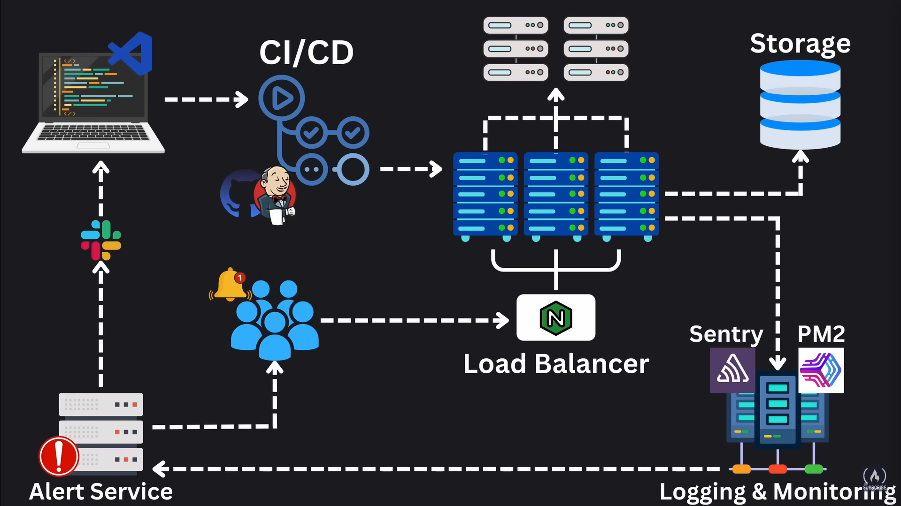
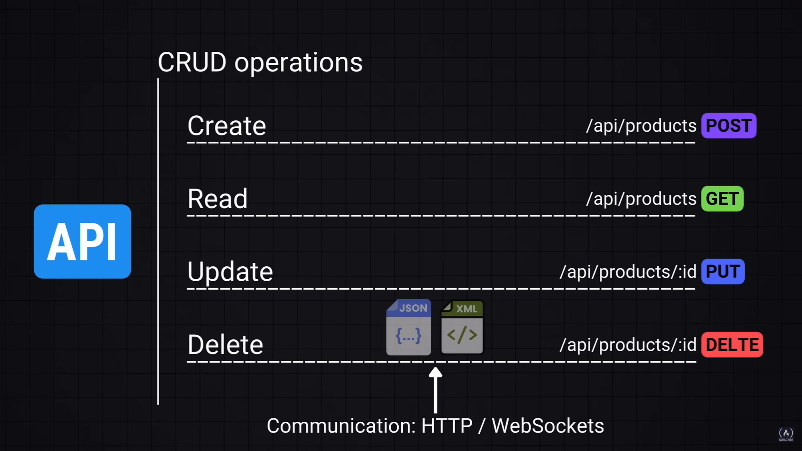

bit - 0 or 1
byte - 8 bits(A,1)
KB - 1024 bytes 
MB - 1024 KBs
GB - 1024 MBs
Tb - 1024 GBs

Computer disk storage holds primary data - HDD | SSD
->Non volatile 
->Contains os and user files 
->size ranges - 256GB , 512 GB, 1TB, 2TB
->SSD(500MB/s to 3500 Mb/s) are more expensive and faster than HDD(80 MB/s to 160 MB/s)

RAM(Random Access Memory)- primary data storage 
->holds data structures , variables, application data
->Allows for quick read/write access 
-> volatile memory 
-> 4GB, 8GB, 16GB(personal comp) -> 32GB, 64GB (high end server)
-> spped - >5000 MB/s

Cache - smaller than RAM typically in MBs but faster than Ram (nanosec in L1 cache)
CPU - first checks the L1 cache-> L2 cache -> L3 cache -> RAM
->L3 cache is shared between CPU cores 
->In Shared memory computer architecture RAM is shared between multiple CPU's 
store freq used data here to optimize cpu performance 

# High Level Architecture of a Production Ready App #

3 par of system design -> Moving Data | Storing Data | Tranforming Data

What makes a good design -> Scalability , Maintainability, Efficiency, Reliability(planning for failure)

CAP Theorem (Brewer's Theorem) - > consistency, availability , partition tolerance 
consistency - if one node is changed the changes must be reflected in all nodes in the distributed sys 
availabilty - system is always operational and open to req (measured in percentages)
partition tolerance - sys capabilty to continue func even if their is a network disturbance 

acc to CAP theorem you can only achieve two out of these at one time CA,CP,AP

# Availability #

99.9% availabilty - 8.76 hrs of downtime/year
99.999% availabilty - 5 min of downtime / year 

SLO - Service level obj  - setting goals for our systems performance like 300ms/ 99.9%
SLA - Service level Agreements - define the mini level of service we're committing to provide 

Reliabilty ,fault tolerance and Reduncdancy 

Measures of Speed -> 

-> Throughput - how much data our sys can handle over a certain period of time 
  -> RPS ->  req per sec, server throughput
  -> QPS -> query per sec, db throughout 
  -> byte/s-> data throughtput 

-> Latency -> how long it takes to handle a single request 

# Networking Basics 
IPv4 - 32bit address - 4 billion
IPv6 - 128bit - 340 trillion 

IP (internet protocol) set of rules that defines how data is sent and received over the internet
Application layer -> an abstraction layer that specifies the shared communication protocols and interface methods used by hosts in a communications network

# Transport layer
-> TCP - Transmission control protocol -> Connection-oriented protocol.
Ensures reliable, ordered, and error-checked delivery of data.
Uses a three-way handshake for connection establishment.
Suitable for applications requiring accuracy, like web browsing (HTTP/HTTPS), email (SMTP), and file transfers (FTP).

-> UDP - User Datagram Protocol -> Connectionless protocol.
Faster but does not guarantee delivery, order, or error correction.
Suitable for real-time applications like video streaming, gaming, and VoIP.
Uses minimal overhead compared to TCP.

DNS -> Domain Name system - DNS is a hierarchical system that translates human-readable domain names (e.g., example.com) into IP addresses (e.g., 192.168.1.1), allowing computers to locate and communicate with each other on the internet.

How DNS Works:
User Request: A user enters a domain name in the browser.
Recursive Query: The request is sent to a DNS resolver (usually provided by an ISP).
Root Server: The resolver queries a root DNS server for the domain.
TLD Server: The root server directs the query to the relevant Top-Level Domain (TLD) server (e.g., .com server).
Authoritative DNS Server: The TLD server directs the query to the authoritative DNS server, which provides the IP address.
Response: The resolver returns the IP address to the browser, which connects to the website.

AAAA Record (4A): Maps a domain name to an IPv6 address 
A Record : Maps a domain name to an IPv4 address 
CNAME Record: Redirects a domain to another domain.

# Networking infrastructure
Public IP address (Ex- 172.16.254.1) - unique across the internet
Private IP address (ex- 172.16.254.1)- unique across a local network 

Ports -> some are reserved like 
80 - http
443 - https
22- ssh
mysql - 3306

Application layer protocols ->
# HTTP (hyper text transfer protocol) 
- built on tcp/ip . it is a request/response protocol. it is stateless that is no memory is involved each interaction is independent.
Each request carry all the info like - url, query, body, method, status code
one way connection 

# status code 
1xx (Informational)
  100 Continue – Request received, continue sending.
  101 Switching Protocols – Server switching protocols.
2xx (Success)
  200 OK – Request successful.
  201 Created – Resource created successfully.
  204 No Content – Successful, but no response body.
3xx (Redirection)
  301 Moved Permanently – Resource moved to a new URL.
  302 Found – Temporary redirection to another URL.
  304 Not Modified – Cached version can be used.
4xx (Client Errors)
  400 Bad Request – Invalid request syntax.
  401 Unauthorized – Authentication required.
  403 Forbidden – Access denied.
  404 Not Found – Resource not found.
  405 Method Not Allowed – HTTP method not supported.
  429 Too Many Requests – Rate limit exceeded.
5xx (Server Errors)
  500 Internal Server Error – Generic server failure.
  501 Not implemented
  502 Bad Gateway – Invalid response from upstream server.
  503 Service Unavailable – Server overloaded or down.
  504 Gateway Timeout – Upstream server timed out.

# Http methods 
GET – Retrieve data from a server (read-only).
POST – Send data to create a new resource.
PUT – Update/replace an existing resource.
PATCH – Partially update an existing resource.
DELETE – Remove a resource from the server.

# Web sockets 
full-duplex communication protocol that enables real-time bidirectional data exchange between a client and a server over a single persistent TCP connection.
How It Works:
Handshake: Starts as an HTTP request, then upgrades to WebSocket.
Open Connection: Persistent connection established.
Data Exchange: Both client and server send/receive messages asynchronously.
Close Connection: Either side can terminate when done.

# Email realeted protocols:
SMTP- Email transmission across the internet.
IMAP (Internet message Access Protocol)- used to retrieve emails from a server
POP3 (Post office Protocol version 3)- used for downloading emails from a server

# File transfer protocol
FTP- for transferring files over the internet 
SSH- For command-line login and file transfer 

# Real time communication 
WebRTC : enables browser-to-browser applications for voice calling, video chat, and file sharing 
MQTT : Lightweight messaging protocol mainly used in IOT device (Message Queuing Telemetry Transport)
AMQP : Protocol for message-oriented middleware (Adv Message Queuing Protocol)

# API

Rate Limiter -> controls the number of requests a client can make to a server within a given time frame, preventing abuse, overload, and DDoS attacks.
Common Rate Limiting Algorithms:
Fixed Window – Limits requests per fixed time window (e.g., 100 requests per minute).
Sliding Window – More dynamic; counts requests within a rolling time window.
Token Bucket – Requests consume tokens; refilled at a set rate.
Leaky Bucket – Processes requests at a fixed rate, preventing bursts.
Implementation Examples:
API Gateways (e.g., AWS API Gateway, Nginx, Cloudflare).
Middleware in frameworks (e.g., Express.js rate-limit, Django throttling).
Redis-based rate limiting for high performance.

Caching - stroing a copy of data in a temp storage so that the future request of the data can be served faster 
Browser caching - storage location - client's computer
when the requested data is peresent in the cache it is called cache hit 
on the otherhand it is called cache miss when the data is not present in the cache 
cache Ratio - Cache hits/ cache hits + cache misses 

Server Caching - storage location - server 
Database Caching - storage location - database 

Elimination evaluation - least Recently Used(LRU), Frist In First Out(FIFO), Least Frequently Used (LFU)

CDN - Content Delivery Network -  network of distributed servers that caches and delivers web content (HTML, CSS, JavaScript, images, videos) closer to users, improving speed, reliability, and security.

Key Benefits:
Faster Loading Times, Reduced Server Load, Better Scalability, DDoS Protection

How It Works:
    ->User requests a webpage.
    ->CDN server closest to the user serves cached content.
    ->If the content is missing, the CDN fetches it from the origin server and caches it.

Popular CDN Providers: Cloudflare, Amazon CloudFront, Google Cloud CDN

Types of CDN
Pull CDN – Fetches and caches content on demand when a user requests it.

Best for dynamic and frequently updated content.
Example: Cloudflare, Fastly.
Push CDN – Content is manually uploaded to CDN servers in advance.

Best for static content with less frequent updates.
Example: Amazon S3 + CloudFront.

# Proxy Server 
acts as an intermediary between a client and the internet, forwarding requests and responses while enhancing security, privacy, and performance.

Key Benefits:
Anonymity & Privacy – Hides the client’s IP address.
Security – Filters malicious traffic and prevents attacks.
Caching – Speeds up access by storing frequently requested content.
Access Control – Restricts access to certain websites or content.
Bypassing Restrictions – Helps access blocked or geo-restricted content.

Types of Proxy Servers:
Forward Proxy – Used by clients to access the internet securely.
Reverse Proxy – Sits in front of servers to handle traffic and security.
Transparent Proxy – Intercepts traffic without modifying it (often used for monitoring).
Anonymous Proxy – Hides user identity but still reveals it’s a proxy.
Elite Proxy – Fully hides user identity and proxy usage.
SOCKS Proxy – Works at a lower level, supporting various types of traffic (e.g., torrents).

Load Balancer - distributes incoming network traffic across multiple servers to ensure high availability, scalability, and reliability of applications.

Key Benefits:
              Prevents Server Overload – Balances traffic across multiple servers.
              Improves Performance – Reduces latency by directing users to the optimal server.
              Ensures High Availability – If one server fails, traffic is redirected to others.
              Enhances Security – Protects against DDoS attacks by distributing requests.

Types of Load Balancers:
              Hardware Load Balancer – Uses physical devices (e.g., F5, Citrix NetScaler).
              Software Load Balancer – Runs on software (e.g., Nginx, HAProxy, Traefik).
              Cloud Load Balancer – Managed by cloud providers (e.g., AWS ELB, Google Cloud Load Balancer).

Load Balancing Algorithms:
              Round Robin – Distributes requests sequentially.
              Least Connections – Sends traffic to the server with the fewest active connections.
              IP Hashing – Routes requests based on the client’s IP address.
              Weighted Load Balancing – Assigns different weights to servers based on capacity.

Use Cases:
              Scalable web applications (e.g., large-scale websites, APIs).
              Distributing database requests (e.g., read replicas).
              Microservices and containerized applications in Kubernetes.

# Database

# Relational Database
stores structured data in tables with relationships using keys and follows ACID( Atomicity, Consistency, Isolation, and Durability) principles for reliability.
Atomicity – Ensures a transaction is all or nothing (no partial execution).
Consistency – Guarantees database remains in a valid state before and after transactions.
Isolation – Ensures concurrent transactions don’t interfere with each other.
Durability – Ensures committed transactions persist even after failures.

Popular Relational Databases:
MySQL – Open-source, widely used.
PostgreSQL – Advanced, supports JSON, extensible.
SQLite – Lightweight, used for local storage.

# No SQL Databases
non-relational database designed for scalability, flexibility, and high-performance in handling unstructured or semi-structured data.

Key Features:
    Schema-less – No fixed structure like relational databases.
    Scalable – Designed for horizontal scaling.
    Fast Performance – Optimized for high-speed read/write operations.

Types of NoSQL Databases:
    Document-based – Stores JSON-like documents (e.g., MongoDB, CouchDB).
    Key-Value – Simple key-value pairs (e.g., Redis, DynamoDB).
    Column-family – Stores data in columns (e.g., Cassandra, HBase).
    Graph-based – Handles complex relationships (e.g., Neo4j, ArangoDB).

Use Cases:
Real-time applications, big data, IoT, and scalable web apps.

# Database Scaling 
process of increasing a database’s capacity to handle more traffic and data efficiently.

Types of Scaling:
Vertical Scaling (Scaling Up)
    Increases power (CPU, RAM, SSD) of a single server.
    Simple but has hardware limitations.
    Example: Upgrading an RDS instance.

Horizontal Scaling (Scaling Out)
    Adds more servers to distribute load.
    More scalable, supports high traffic.
    Example: Sharding in MongoDB, Read Replicas in PostgreSQL.

Techniques:
Replication – Copies data across multiple servers for redundancy.
    Master - slave -> one master db(read/write) and several slave db(read only)
    Master - Master - both read/write access
Sharding – Splits data into smaller chunks across different servers.
    Range Based : Based on the range of a given key 
    Directory Based : Lookup service to direct traffic to the database
    Geographical : based on geographic location

Caching – Uses Redis/Memcached to reduce database queries.
Load Balancing – Distributes requests efficiently across database instances.

Database performance refers to the speed and efficiency of query execution, ensuring fast response times and optimal resource utilization.

Key Optimization Techniques:
Indexing – Uses indexes (e.g., B-Trees, Hash Indexes) to speed up queries.
Query Optimization – Avoids unnecessary joins, selects only required columns (SELECT * is bad).
Caching – Uses Redis/Memcached to store frequently accessed data.
Connection Pooling – Reuses database connections to reduce overhead.
Load Balancing – Distributes database requests across multiple servers.
Partitioning – Divides large tables into smaller, more manageable parts.